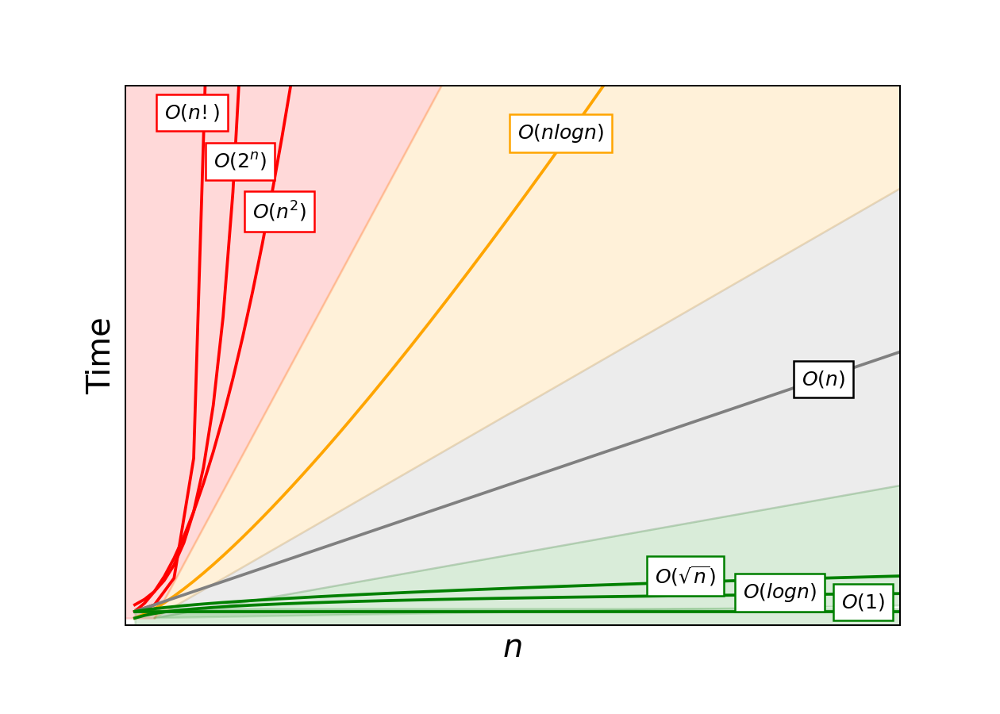

# Algorythms-and-Data-Structures-Python

## Big O notation
### Полезное видео с подробным объяснением [link](https://www.youtube.com/watch?v=D6xkbGLQesk&ab_channel=CSDojo)(на английском, объясняет на подробных примерах на пайтоне)

 

  
  
График зависимости входных данных(n) от времени(Time)

 

**Big O notation -** это способ описания оценки производительности алгоритма или функции. Оно позволяет определить, как время выполнения (или использование ресурсов) алгоритма зависит от размера входных данных, называемого "n". Для оценки всегда берется худший вариант, то есть когда размер входных данных стремится к бесконечности.

**Идеальные решения O(1):** Как видно на графике O(1) это самые эффективные, эта запись означает что не важно сколько у нас будет входных данных хоть бесконечность, всегда будет только 1 операция.  

**Например получение элемента в списке по индексу**  

    Важный момент состоит в том что списки в пайтоне это как раз таки  динамический массив а не связаный список. Прикинь что память это тетрадь где у каждой страницыесть адрес какой-то. Вот list в пайтоне записан на одной страничке, каждый элемент идет за другим построчно и эта страничка называется именем переменной в которой и хранится твой list. И вот например в `my_list = lis (range(10))` когда ты обращаешься `my_list[5]` он переходит на страничку `my_list` а именно на первый элемент, зная, что размер одной цифры 28 байтов он просто умножает 28 на индекс(5) и таким образом очень быстро оказывается на нужном элементе. Даже если мы рассматриваем худший вариант там например 10000000 элемент это все равно просто 1 математическая операция.

**Прекрасные решения O(log n):** Ну если говорить про то как звучит определение то Оценка сложности O(log n) означает логарифмическую зависимость времени выполнения алгоритма от размера входных данных n. Это говорит о том, что время выполнения алгоритма увеличивается медленнее, чем линейно, при увеличении размера входных данных. Это делает алгоритмы с оценкой O(log n) очень эффективными для работы с большими объемами данных.  

### Например:
    Сюда можно будет потом написать много алгоритмов связаные с делением и укорочиванием но я пока просто не хочу грузить. Главное сейчас понимать что это алгоритмы которые прекрасно работают с большими объемами данных (в разы лучше чем O(n)). Например есть алгоритмы которые с каждым шагом делят список на все меньшие и меньшие части и потом только их обрабатывают, это и приводит к оптимизации из O(n) к O(log n)

**Линейные решения O(n):** Называется линейной оценкой сложности, потому что ее график представляет из себя прямую зависимость(n прямо пропорционально Time), что означает,что время выполнения алгоритма линейно зависит от размера входных данных n. Чем больше данных тем больше времени займет выполнение этого алгоритма. 

### Например:
- Линейный поиск в списке: 
  > Это просто когда ты попорядку проходишься по списку и проверяешь каждый элемент. В лучшем случае он будет работать за константу(если элемент который мы ищем окажется первым элементом) однако как уже говорилось всегда берется худший вариант, поэтому как быстро мы найдем нужный нам элемент зависит от того сколько элементов в списке  
- Суммирование элементов списка:  
  > Ну тут опять же придется пройтись по всему списку и сложить все элементы.

При анализе сложности алгоритмов, оценка O(n) считается относительно хорошей, и во многих случаях такая сложность является приемлемой. Однако,как уже упоминалось иногда возможно оптимизировать алгоритмы так, чтобы их сложность стала меньше, например, O(log n) или O(1).

**Не самые лучшие решения: O(n^2):** Эта оценка обозначает, что время выполнения алгоритма растет квадратично в зависимости от n. Если время выполнения алгоритма имеет оценку O(n^2), то, например, при увеличении размера входных данных в два раза (n -> 2n), время выполнения увеличится в четыре раза (2^2 = 4), а не в два раза

### Например:
- **Сортировка пузырьком (Bubble Sort):** Это простой алгоритм сортировки, который проходит по массиву многократно, сравнивая соседние элементы и меняя их местами, если они стоят в неправильном порядке.

- **Сортировка выбором (Selection Sort):** Это алгоритм сортировки, который на каждом шаге ищет минимальный элемент в оставшейся части массива и меняет его местами с элементом на текущей позиции.

- **Сортировка вставками (Insertion Sort):** Это алгоритм сортировки, который строит отсортированную последовательность путем вставки элементов на свои места в уже отсортированной части массива.

> Не смотря на то что у них очень плохая эффективность относительно других сортировок, они тоже имеют место быть. `Сортировка пузырьком` скорее просто для показать базовые принципы сортировки и понимание алгоритмов, однако например `Сортировка вставками` может быть эффективной для данных, которые уже частично отсортированы, и она может превзойти другие алгоритмы для таких случаев. Да и большинство сортировок работают на равне когда объем данных небольшой , а реализация проще.

**Ужасные решения: O(2^n) и O(n!):** Эти оценки говорят о том, что время выполнения алгоритмов растет очень быстро с увеличением размера входных данных n, что делает их чрезвычайно неэффективными для больших объемов данных.
Ну то есть O(2^n) это значит мол каждое увеличение n приводит к удвоению времени выполнения, а O(n!) к умножению времени выполнения на n. Встречаются редко однако тоже есть как например:
> **Задача коммивояжера** с полным перебором всех возможных маршрутов:
Задача коммивояжера требует нахождения самого короткого маршрута, который проходит через все города и возвращается в начальный город. Полный перебор всех возможных маршрутов также имеет оценку сложности O(n!).