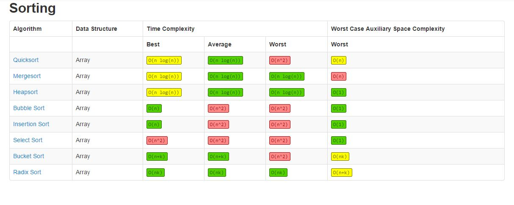

# Sorting Algorythms

Сортировка - это процесс упорядочивания элементов в определенном порядке. В контексте программирования и алгоритмов, сортировка представляет собой упорядочивание элементов в списке, массиве или другой структуре данных в заданном порядке, как например по возрастанию или убыванию для того чтобы облегчить доступ к данным либо их анализ.

  
  
Оценка сложности алгоритмов сортировок

### Мы не будем реализовывать все эти сортировки а обойдемся тремя, самыми часто используемыми и эффективными(это не значит что другие плохие, про их существование тоже лучше знать, хотя бы в общих чертах будет плюсом [ссылка](https://tproger.ru/translations/sorting-algorithms-in-python/)), а именно:

1. **TimSort:** Это сортировка используемая в Python под капотом таких методов как `list.sort()` и `sorted()`. Timsort сочетает в себе преимущества сортировки вставками и сортировки слиянием, средняя и худшая оценка *O(n log n)* где *n* размер списка.  
Работа Timsort основана на идее разделения списка на маленькие подсписки, которые сортируются с помощью сортировки вставками, а затем эти подсписки объединяются и сливаются с помощью сортировки слиянием.

2. **Merge Sort(Сортировка слиянием)**: Также как и Timsort у него оценка сложности O(n log n) 

    - **Основные шаги алгоритма Merge Sort:**

        - **Разделение:** Исходный массив разбивается на две половины, и каждая из них рекурсивно сортируется. Этот шаг продолжается до тех пор, пока размер массива не станет равен 1. Массивы размером 1 считаются отсортированными.

        - **Слияние:** Отсортированные половины объединяются в новый временный массив. При объединении элементы сравниваются, и меньший элемент помещается в новый массив. Этот процесс повторяется до тех пор, пока все элементы не будут добавлены в новый массив.

        - **Замена:** Отсортированный временный массив заменяет соответствующий кусок в исходном массиве.

    >Для работы с небольшими объемами данных лучше использовать другие алгоритмы сортировки например  Quick Sort

3. **Quick Sort(Быстрая сортировка)**: это один из самых эффективных алгоритмов сортировки, который использует принцип "разделяй и властвуй".

    - **Основные шаги алгоритма Quick Sort:**

        - **Выбор опорного элемента:** Из исходного массива выбирается опорный элемент (пивот). Опорный элемент помещается в правильную позицию, таким образом, что все элементы меньше опорного находятся слева от него, а все элементы больше или равные опорному - справа от него.

        - **Разделение массива**: Массив разделяется на две части вокруг опорного элемента: элементы меньше опорного и элементы больше или равные опорному. Этот шаг выполняется с помощью двух указателей, один из которых движется слева направо, а другой - справа налево, пока они не встретятся. Как только указатели встречаются, массив делится на две части.

        - **Рекурсивная сортировка:** Процедура Quick Sort рекурсивно применяется к двум частям массива, которые были получены на предыдущем шаге, то есть к частям с элементами меньше опорного и с элементами больше или равными опорному.
        - **Объединение отсортированных частей:** После того как рекурсивные вызовы завершаются и каждая часть массива становится отсортированной, отсортированные части объединяются вместе, и тем самым исходный массив становится полностью отсортированным.

    > Quick Sort - это алгоритм "на месте", что означает, что он не требует дополнительной памяти для хранения временных массивов. Это делает его эффективным для сортировки больших объемов данных. Quick Sort также является адаптивным, что означает, что он может быть эффективен для уже частично отсортированных данных.